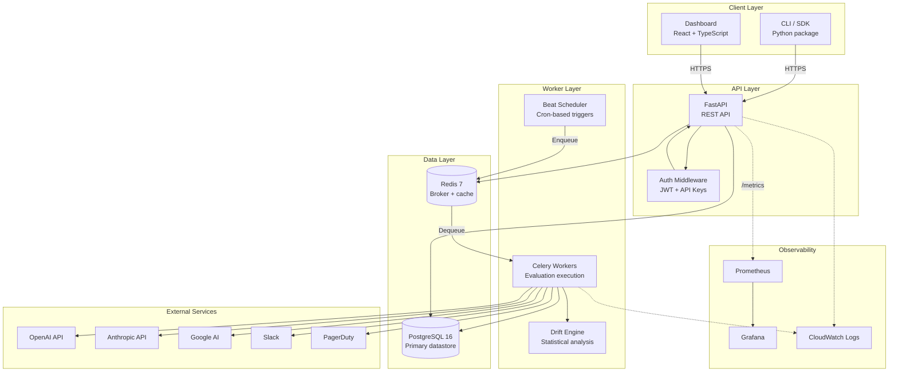
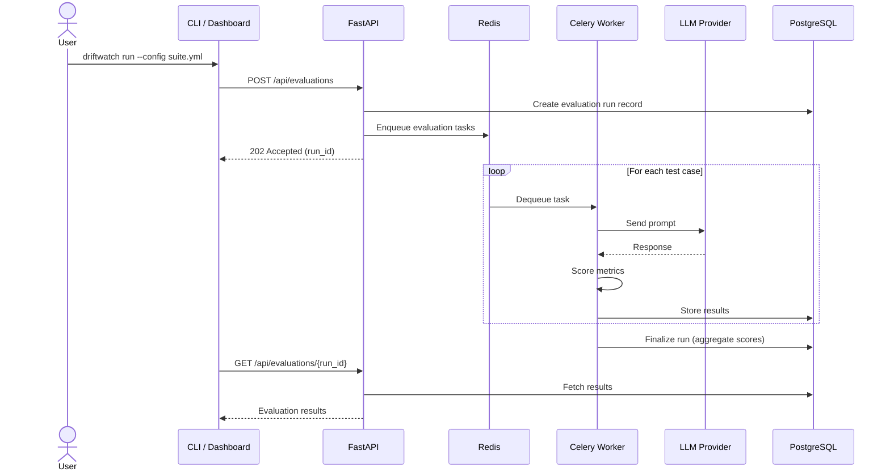
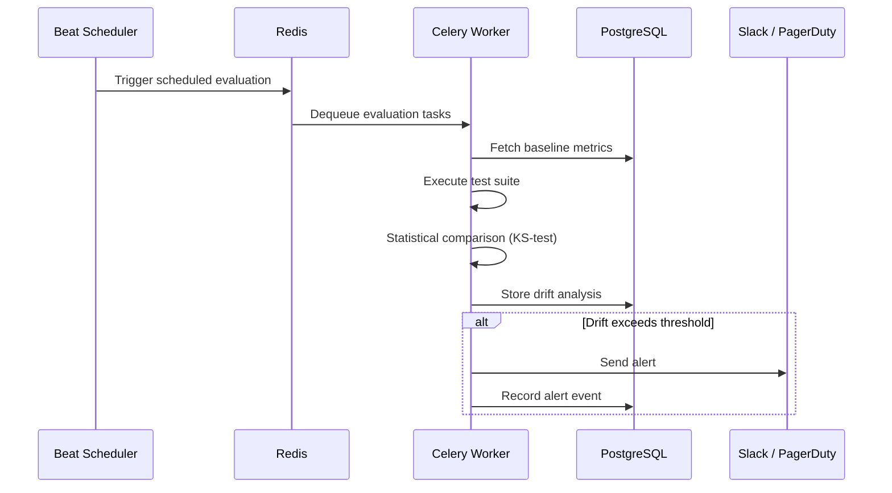
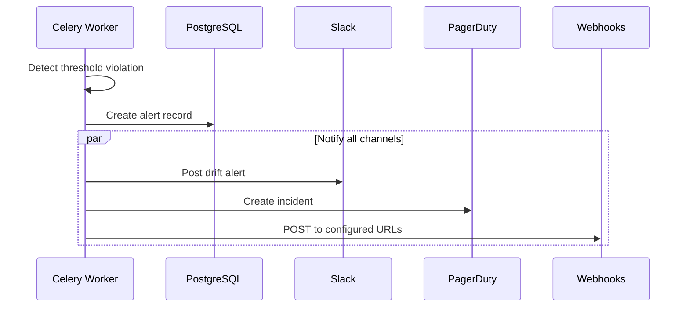
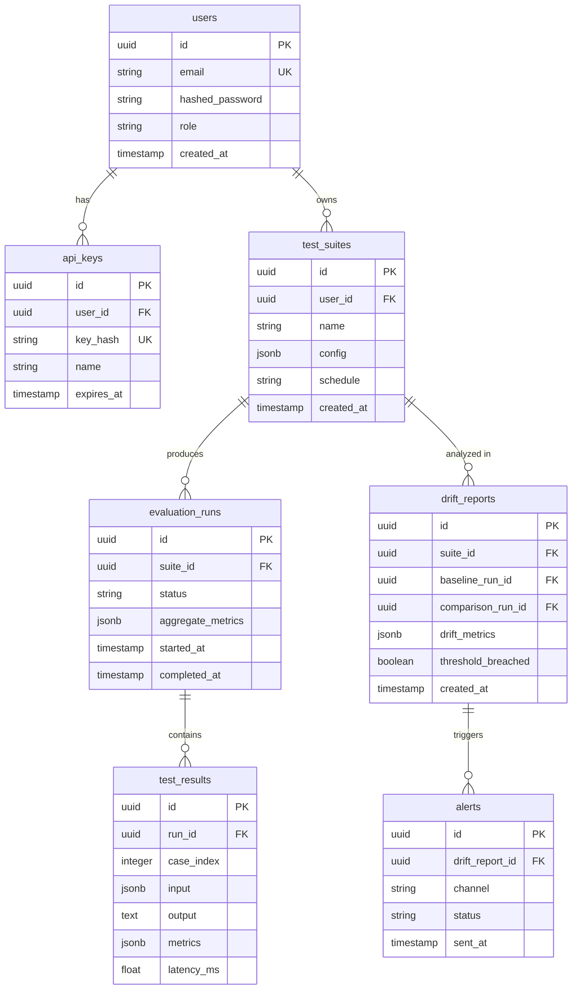
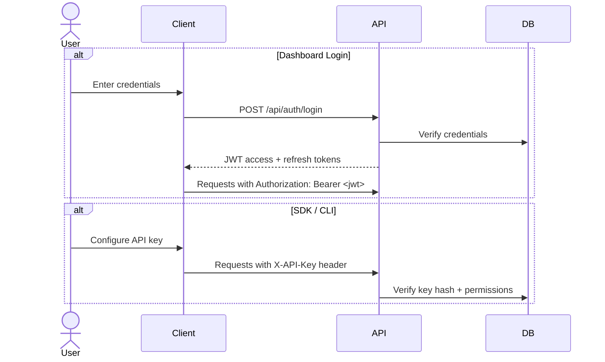
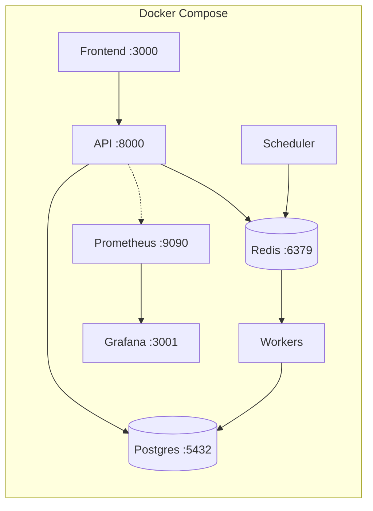
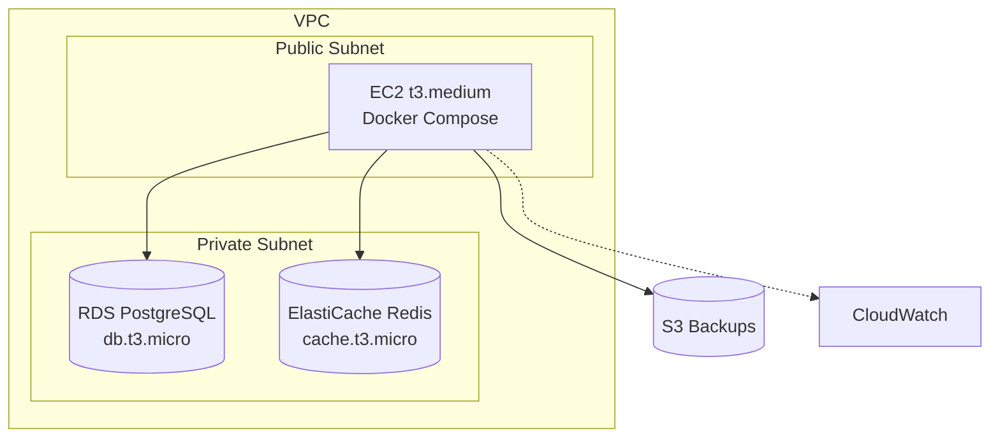
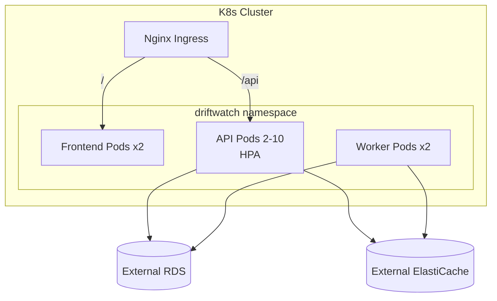

# DriftWatch Architecture

## System Overview

DriftWatch is a platform for continuous LLM evaluation and drift monitoring. It combines a Python CLI/SDK, a FastAPI backend with Celery workers, a React dashboard, and a PostgreSQL + Redis data layer.

## Component Descriptions

### CLI / SDK (`driftwatch/`)

The Python package published to PyPI. Provides:

- **CLI** (`driftwatch run`, `driftwatch suites list`, etc.) for terminal-based workflows
- **Python client** (`driftwatch.Client`) for programmatic access
- **Configuration parser** for YAML test suite definitions
- Communicates with the backend over HTTP

### FastAPI API (`backend/app/`)

The central REST API handling all client requests:

- **Authentication** via JWT tokens (dashboard) and API keys (CLI/SDK)
- **Evaluation management** — CRUD operations on test suites and evaluation runs
- **Drift analysis** — query drift reports and threshold violations
- **Prometheus metrics** endpoint at `/api/metrics`
- **WebSocket** support for live evaluation progress

### Celery Workers (`backend/worker/`)

Background task processors responsible for:

- Executing evaluation test cases against LLM providers
- Running drift detection algorithms (KS-test, Mann-Whitney U, custom)
- Sending alert notifications when thresholds are breached
- Processing scheduled evaluation batches

### Beat Scheduler

Celery Beat process that triggers evaluations based on cron schedules defined in test suites.

### React Dashboard (`frontend/`)

Single-page application built with React 18, TypeScript, and Vite:

- Real-time evaluation monitoring
- Historical metric visualization (charts, heatmaps)
- Test suite management interface
- Drift detection alerts and timeline
- Configuration and settings management

### PostgreSQL Database

Primary datastore holding:

- Test suite definitions and configurations
- Evaluation run results and individual test case outcomes
- Metric time-series data
- User accounts and API keys
- Alert history

### Redis

Serves two roles:

- **Message broker** for Celery task queue
- **Cache layer** for API response caching and rate limiting

## Data Flow Diagrams

### Test Execution Flow

### Drift Detection Flow

### Alert Flow

## Database Schema Overview

## API Design Principles

- **RESTful** — resources are nouns, HTTP verbs for actions
- **Versioned** — all endpoints under `/api/` (future: `/api/v2/`)
- **Pagination** — cursor-based pagination for list endpoints
- **Consistent errors** — RFC 7807 problem detail format
- **Async** — all database I/O is async (SQLAlchemy + asyncpg)
- **Idempotent** — safe retries with idempotency keys for POST operations
- **Rate limited** — token bucket per API key, stored in Redis

## Security Architecture

### Authentication Flow

### Security Layers

- **Transport** — TLS everywhere (enforced at ingress/load balancer)
- **Authentication** — JWT (dashboard) + API keys (SDK/CI)
- **Authorization** — Role-based access control (admin, member, viewer)
- **Input validation** — Pydantic models for all request bodies
- **SQL injection** — parameterized queries via SQLAlchemy ORM
- **Rate limiting** — per-key limits stored in Redis
- **Secrets** — Kubernetes Secrets / AWS Secrets Manager, never in code

## Deployment Architecture

### Local Development (Docker Compose)

All services run locally via `docker compose up`. Suitable for development and small-scale self-hosting.

### AWS Production (Terraform)

EC2 instance running Docker Compose, backed by managed RDS and ElastiCache. CloudWatch for logging and alerting.

### Kubernetes (Production-scale)

For larger deployments, Kubernetes manifests provide auto-scaling, rolling updates, and high availability.

